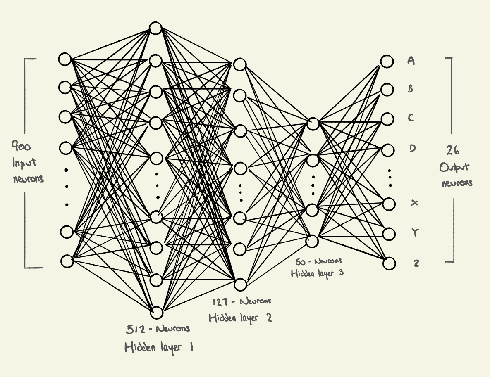

Distinguish-Handwritten-Alphabet
================================

Introduction
------------
Have you ever had the problem of wanting to convert your handwriting into text on your devices? Well, I have and it is frustrating and time-consuming to copy texts manually constantly. Software Engineers and many machine learning researchers have come up with lots of ideas on how to implement this task, and here I decided to tackle this problem using Neural Networks.


Installing Packages
-------------------
Packages used:

```python
import warnings
import pandas as pd
import matplotlib.pyplot as plt
import sklearn
import os
import cv2 
import csv
```

Installing package, run:

```terminal
pip install pandas, matplotlib, sklearn, os, cv2, csv, warnings
```

Quick Overview
--------------
To distinguish handwritten alphabets, I started off planning the machine learning model. The whole process can be separated through a pipeline (as seen down below). The first part is gathering enough images to be represented as data, then converting the image into useful data for the neural network, then followed by training the neural network to be able to predict new photos


Gathering Images
----------------
The first step of this process is to gather enough data for the neural network. I made sure to gather an equal amount for each class to ensure that all classes were considered equally and had enough data to identify them. Since there are a lot of free white spaces around the letters, it decreases the accuracy of the features as the only useful data of the image is relatively small. A solution I arrived at was to build an identifier allowing the letters to be boxed, making the new margin to be the training data.


Initialising Data
-----------------
All of the code can be found in GenerateData.py
After gathering the training data, we convert the image into a grayscale image before converting it into a NumPy array of pixels using cv2, this is simply because having colours will not affect the identification of the letters as well as having colours consume more memory space due to RGB needs to be stored instead of a singular float. After converting the image into a 30x30 NumPy array, I regularised the data by dividing it by 255, since it is black and white, the white is noted as 1, and black as 0. This way it is easier for the neural network to do its gradient descent. We store the regularised arrays with its expected letter in a CSV file (DATA.csv) where it could be used for training the neural network.


Training the Neural Network
---------------------------
All of the code can be found in Recognition.py

Once the CSV file is written, we can finally start training the neural network. First, we shuffle the data set in the CSV and split it up into 3 subsets, 80% training set, 10% validation set and 10% test set. The training set is used to train the data, the validation set is used to identify several hidden layers and what the learning rate should be, and the test set to see the accuracy of the model. 

The solving algorithm I used here is stochastic gradient descent, simply because I have the best understanding of that algorithm. I initialised the max iteration to be 300 in order to ensure the cost function is minimised and setting the 3 hidden layers (512, 127, 50). Training the neural network is relatively simple using sklearn and the code can be found below:
```python 
mlp = MLPClassifier(solver="sgd", hidden_layer_sizes=(512, 127, 50), max_iter=300, verbose=1)
mlp.fit(X_train, y_train)
```

After training the data, we can start analysing the model with the validation and test set by comparing the model's predictions to the true expected values, getting the accuracy score and plotting the cost function over time.




Results
-------
After running the model with the training set, I have tested the model with the validation set and test set. The result of running the model with stochastic gradient descent can be found in the SgdResult.txt file, but to summarise, the validation set had an accuracy of 93% while the test set had an accuracy of 90%.

I have also ran the model with Adam as its solver and the results can be found in the AdamResult.txt file, it has a 93.7% accuracy for the validation set and 90% accuracy for the test set.


